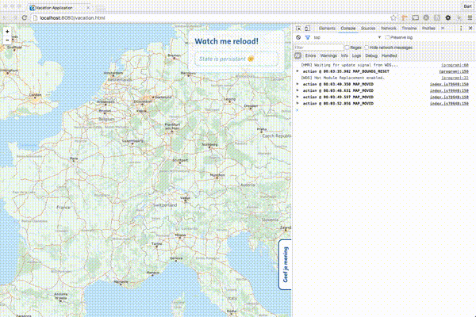

# redux-simple-storage-middleware

Simple `redux` middleware which will store the current state tree in either session- or localstorage. This helps creating an awesome developer experience when combined with hot reloading.



## Installation

```bash
npm i -S redux-simple-storage-middleware
```

## How to use?

### Use middleware

The middleware can be dropped into the `redux` middleware chain and will store the complete redux state in either local- or sessionstorage.

```js
  import {applyMiddleware, createStore, compose} from 'redux';
  import createStorageMiddleware from 'redux-simple-storage-middleware';

  const sessionStorageMiddleware = createStorageMiddleware({
    key: 'my-unique-key-for-session-storage',
  });

  const localStorageMiddleware = createStorageMiddleware({
    key: 'my-unique-key-for-local-storage',
    type: 'localStorage', // The default type is sessionStorage but can be switched to localStorage
  });

  let store = createStore(
    rootReducer, // The main reducer which will be stored in the specified storage
    initialState, // The state to load and prefill the redux store with
    compose(
      applyMiddleware(
        // All middleware
        localStorageMiddleware
      )
    )
  );
```

### Get initial state

Only using the middleware to store the state tree is not that usefull. That's why `redux-simple-storage-middleware` also supports initialising the state from local- or sessionstorage.

```js
  import {applyMiddleware, createStore, compose} from 'redux';
  import createStorageMiddleware, {getStorageState} from 'redux-simple-storage-middleware';

  const sessionStorageMiddleware = createStorageMiddleware({
    key: 'my-unique-key-for-session-storage',
  });

  const storageState = getStorageState({
    key: 'my-unique-key-for-session-storage',
    // type: 'localStorage' or 'sessionStorage'
    // defaultReponse: any value to use when no storage is available
  });

  let store = createStore(
    rootReducer, // The main reducer which will be stored in the specified storage
    storageState, // The state to load and prefill the redux store with
    compose(
      applyMiddleware(
        // All middleware
        localStorageMiddleware
      )
    )
  );
```

## Reference

### storagePossible

This variable stores whether it's possible to use the storage

### createStorageMiddleware

This middleware for redux will store the application state in storage

**Parameters**

-   `settings`  An object containing the settings for the middleware
    -   `settings.key`  The identifier to be used to store state in storage
    -   `settings.type`  The type of storage to use either sessionStorage or localStorage
    -   `settings.exclude`  The reducers to exclude from storing
-   `$0` **[Object](https://developer.mozilla.org/en-US/docs/Web/JavaScript/Reference/Global_Objects/Object)** 
    -   `$0.key`  
    -   `$0.type`   (optional, default `'sessionStorage'`)
    -   `$0.exclude`  

Returns **** The final result when all reducers have run

### storageTest

This will test whether the requested type of storage is available or not

**Parameters**

-   `type` **[string](https://developer.mozilla.org/en-US/docs/Web/JavaScript/Reference/Global_Objects/String)** The type of storage to test

Returns **** True or false depending on whether the storage is available or not

### getStorageState

This will get the application state from storage when available

**Parameters**

-   `settings`  Object containing all settings for the state retreival
    -   `settings.key`  The identifier to be used to retreive state from storage
    -   `settings.type`  The type of storage to use either sessionStorage or localStorage
    -   `settings.defaultReponse`  The response to give when no storage can be used or if their is nothing available
-   `$0` **[Object](https://developer.mozilla.org/en-US/docs/Web/JavaScript/Reference/Global_Objects/Object)** 
    -   `$0.key`  
    -   `$0.type`   (optional, default `'sessionStorage'`)
    -   `$0.defaultReponse`  

Returns **** The state last stored in storage
